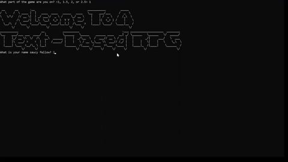
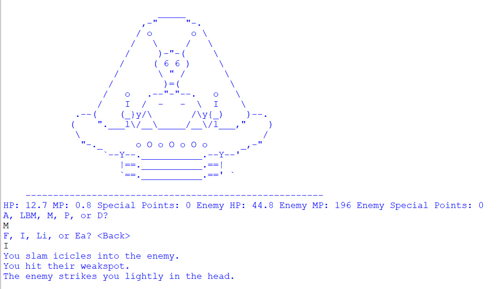
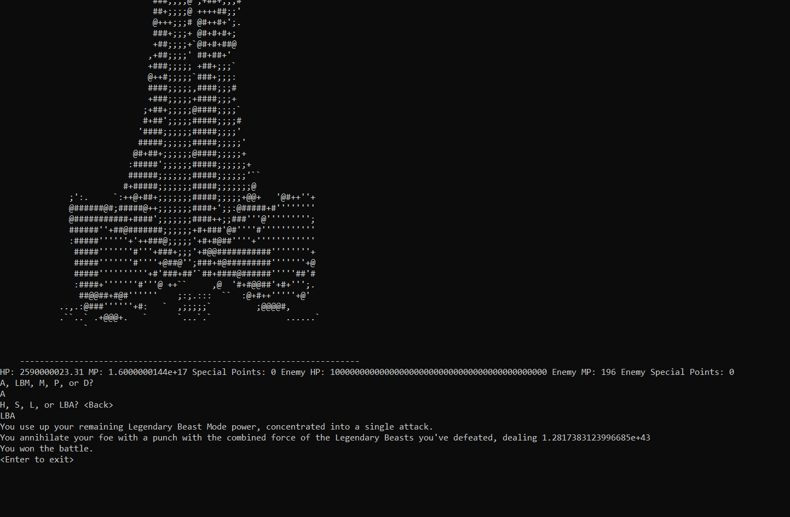

# Text-Game
A text-based turn-based game written in Python. It features a rock-paper-scissors combat (with basic attacks) and other additional features to add more uniqueness to this system. ([Demo Video](https://youtu.be/m5MgikbB2TY))

By [Ethan Saunders](https://github.com/esaundere) 
Course: Computer Science ICS20 (Grade 10 course)  
Date: December 11th, 2018  
Grade: 100%

  

## Table of Contents
[1. Intro](#Intro)  
[2. Gameplay](#Gameplay)  
[3. Environment Setup](#Environment-Setup)  
[4. How to Play](#How-to-Play)  
[5. Results](#Results)  
[6. Next Steps](#Next-Steps)  
[7. Development Changelog](#Development-Changelog)

## Intro

This game was inspired by my enjoyment of turn-based video games and this process showed me the difficulties that come with game development as I had a fun time trying to balance my game (it still needs some work).

## Gameplay

Check out the demo video for this project [here](https://youtu.be/iMbGX3d2MWY)!

  

## Environment Setup

To successfully run this project, please follow these steps to set up your environment:

1. Install Python 3.10.0 or later ([Download Python here](https://www.python.org/downloads/))

## How to Play

Basic attacks are similar to rock-paper-scissors here where head > stomach > legs and legs > head.
Enemies have different chances to choose an action so noticing which attack the enemies use a lot will give you an advantage. 
Choosing the stronger attack than the enemy gives points which can be spent on a strong attack that stuns enemies.

Magic attacks simply do damage based on the enemy's resistance to the type of magic you choose. They do more damage but you can't act the next turn.
Hitting an enemy's weakspot is the easiest way to secure victory.

Defending provides the choice to guard or evade. These provide a set chance to negate the enemy's attack that turn but can backfire if unlucky.

In the shop you can upgrade your damage, health, magic, and special attack damage. You can buy potions to use in battle that restore health, mp, and special points. 

LBM was a feature I added later but it expontentially scales your damage the more you power up. It is only important for the endgame when I went crazy with enemy stats. LBA removes LBM so only use it as a finisher.

Run the [combat.py](combat.py) file to play!

There is no saving but you can start from different points in the game.

## Results

This project turned out really well and the game turned out to have more complexity than I expected it to have intially. The project has some flaws but overall, I accomplished my goal to create a text-based game. My friends had a fun time trying to beat my game when we tested each other's projects on the submission date.

At the time, I had no experience coding larger programs so this provided me with the fundamentals needed to work on larger projects in the future and it expanded my knowledge in Python signifcantly.

**Grade: 100% **

## Next Steps
Some potential improvements that I can see myself making in the future:

- Expand the number of unique encounters further and add a random encounter feature with scaling enemies once the final enemy is defeated to increase the amount of content.
- Balance the game properly as some of the first enemies can be significantly harder to beat than they should be due to the randomness of enemy attacks and overtuned enemy stats.
- Restore sound effects to attacks. The version where sound effects played was lost so these need to be added back in.
- Add opportunities for player choice to the game so players can choose the path the story takes.
- Expand the shop to not just upgrade weapons but have a full selection of items to choose and display the increase in the player's stats to show the improvement from purchases.
- Optimize the code as the way it is currently coded is not nearly as efficient as it could be.
- Add the option to save and load data as the current checkpoint system is not convenient for the user.

## Development Changelog
N/A as the development process was not documented.
